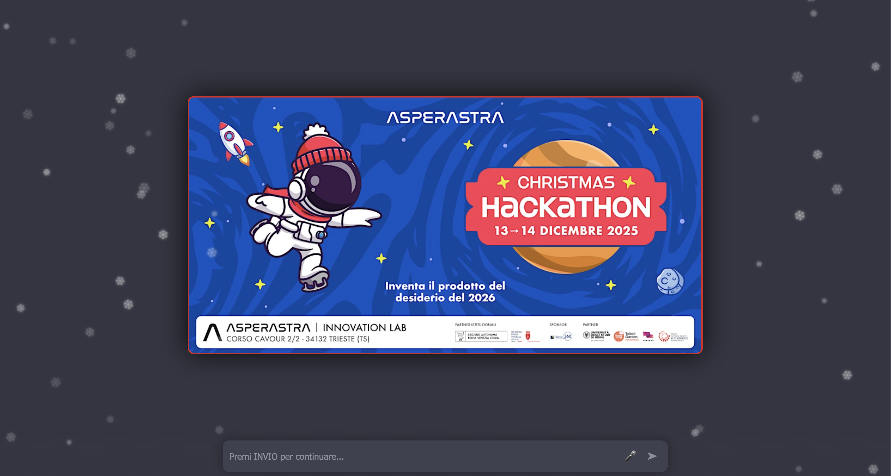

# 🤖 Hackathon AI Mentor - Interactive Presentation System

<div align="center">


Un'applicazione **Single Page Application (SPA)** che simula un'interfaccia ChatGPT per presentazioni interattive dal vivo, sviluppata per l'Hackathon **AsperAstra ** (Trieste).



[Caratteristiche](#-caratteristiche-principali) •
[Quick Start](#-quick-start) •
[Documentazione](#-documentazione) •
[Sviluppo](#-sviluppo) •
[Testing](#-testing)

</div>

---

## 📖 Indice

- [Caratteristiche Principali](#-caratteristiche-principali)
- [Tech Stack](#-tech-stack)
- [Prerequisiti](#-prerequisiti)
- [Quick Start](#-quick-start)
- [Architettura](#-architettura)
- [Configurazione](#-configurazione)
- [Personalizzazione](#-personalizzazione)
- [Sviluppo](#-sviluppo)
- [Testing](#-testing)
- [Deployment](#-deployment)
- [API Documentation](#-api-documentation)
- [Accessibilità](#-accessibilit)
- [Performance](#-performance)
- [Troubleshooting](#-troubleshooting)
- [Contributing](#-contributing)
- [License](#-license)
- [Autore](#-autore)

---

## 🚀 Caratteristiche Principali

### Core Features

- ✨ **Interfaccia Realistica** - Clone pixel-perfect di ChatGPT con tema scuro
- 🎯 **Script Pre-definito** - Zero rischio di allucinazioni o latenza di rete
- ⌨️ **Animazione Typing** - Simulazione realistica carattere-per-carattere con velocità variabile
- 🔀 **Branching Logic** - Supporto per bivi narrativi con bottoni interattivi
- 📊 **Modalità Presentatore** - Vista dedicata con note private, timer e teleprompter
- 💾 **Persistenza Stato** - Salvataggio automatico su localStorage
- 📤 **Export Conversazione** - Export in TXT, Markdown, HTML e JSON

### UX/UI Avanzata

- 📱 **Fully Responsive** - Ottimizzato per mobile, tablet e desktop
- ♿ **WCAG 2.1 AA Compliant** - Accessibilità screen reader e navigazione keyboard
- 🎨 **Animazioni Fluide** - Fade-in, pulse, shake con supporto reduced-motion
- 🎮 **Keyboard Shortcuts** - Controllo completo da tastiera
- 📍 **Progress Tracking** - Barra progresso e sistema bookmarks
- 🔊 **Haptic Feedback** - Vibrazione su dispositivi mobile

### Developer Experience

- 🧩 **Architettura Modulare** - Codice organizzato in moduli ES6
- 🧪 **Test Coverage >70%** - Unit test (Jest) ed E2E (Playwright)
- 🐳 **Docker Ready** - Container ottimizzato < 40MB
- 🔧 **Developer Tools** - ESLint, Prettier, Hot-reload con Docker Compose
- 📚 **JSDoc Completo** - Documentazione inline dettagliata

---

## 🛠️ Tech Stack

| Categoria | Tecnologie |
|-----------|-----------|
| **Frontend** | HTML5, CSS3, Vanilla JavaScript (ES6+) |
| **Server** | Nginx Alpine |
| **Containerization** | Docker, Docker Compose |
| **Testing** | Jest, Playwright |
| **Linting/Formatting** | ESLint (Airbnb), Prettier |
| **CI/CD Ready** | GitHub Actions compatible |

**Nota**: Zero dipendenze runtime - funziona completamente offline!

---

## 📋 Prerequisiti

### Opzione 1: Docker (Raccomandato)
- [Docker Desktop](https://www.docker.com/products/docker-desktop) o Docker Engine
- **Mac Users**: Docker Desktop include Docker Compose V2 (comando `docker compose`)

### Opzione 2: Sviluppo Locale
- Un web server qualsiasi (Python, Node.js, ecc.)
- Browser moderno (Chrome, Firefox, Safari, Edge)

### Opzione 3: Testing e Sviluppo
- Node.js 18+ e npm
- Docker Compose (opzionale)

---

## 🏃‍♂️ Quick Start

### Metodo 1: Docker Production (Più veloce)

```bash
# 1. Build dell'immagine
docker build -t hackathon-ai-mentor .

# 2. Run del container
docker run -d --name ai-presenter -p 8080:80 hackathon-ai-mentor

# 3. Apri il browser
open http://localhost:8080

# 4. Stop e rimozione
docker stop ai-presenter && docker rm ai-presenter
```

### Metodo 2: Docker Compose Development (Con hot-reload)

```bash
# 1. Avvia ambiente di sviluppo
docker compose up

# 2. Apri il browser
open http://localhost:8080

# 3. Modifica i file - le modifiche si riflettono automaticamente!

# 4. Stop
docker compose down
```

> **💡 Nota Mac**: Usa `docker compose` (con spazio, Docker Compose V2) invece di `docker-compose` (vecchio comando standalone)

### Metodo 3: Senza Docker

```bash
# Con Python 3
python3 -m http.server 8080

# Con Node.js (http-server)
npx http-server -p 8080

# Apri http://localhost:8080
```

### Utilizzo Base

1. **Premi INVIO** o clicca **➤** per avviare la presentazione
2. **Premi INVIO** nuovamente per ogni step successivo
3. **Clicca sui bottoni** quando appaiono per scegliere il branch narrativo
4. Usa le **scorciatoie tastiera** per navigazione rapida (vedi sotto)

---

## 🏗️ Architettura

### Struttura Moduli

```
├── config.js              # Configurazione centralizzata
├── script-content.js      # Contenuto copione separato
├── state-manager.js       # Gestione stato e persistenza
├── animation-engine.js    # Motore animazioni typing
├── chat-manager.js        # Rendering messaggi e DOM
├── main.js               # Controller principale
├── index.html            # Markup HTML semantico
└── style.css             # Stili responsive + animazioni
```

### Pattern Architetturali

- **Separation of Concerns** - Ogni modulo ha una responsabilità singola
- **Event-Driven** - Sistema di eventi per comunicazione tra moduli
- **State Management** - Stato centralizzato con history e bookmarks
- **Progressive Enhancement** - Funziona senza JS (HTML statico)

### Diagramma Flusso

```
User Input (INVIO)
    ↓
main.js (playScene)
    ↓
state-manager (getStep, setStep)
    ↓
chat-manager (addMessage)
    ↓
animation-engine (typeText)
    ↓
DOM Update + Auto-scroll
    ↓
Await completion
    ↓
Next scene (automatico o con bottoni)
```

---

## ⚙️ Configurazione

### File `config.js`

Tutte le impostazioni sono centralizzate in `config.js`:

```javascript
const CONFIG = {
    timing: {
        typingSpeed: 30,              // ms per carattere
        aiThinkingDelay: 1500,        // delay "sta scrivendo..."
        punctuationPause: 300,        // pausa su punteggiatura
    },
    ux: {
        enableTypingAnimation: true,  // typing carattere-per-carattere
        enableAutoScroll: true,       // scroll automatico
        showProgressBar: true,        // barra progresso
    },
    accessibility: {
        reducedMotion: false,         // rispetta prefers-reduced-motion
        screenReaderAnnouncements: true,
    },
    // ... altre opzioni
};
```

### Temi

Due temi disponibili: `dark` (default) e `light`.

Per cambiare tema:
```javascript
document.body.classList.add('light-theme');
```

O usa lo shortcut: **Premi T**

---

## 🎨 Personalizzazione

### Modificare lo Script

Edita `script-content.js`:

```javascript
const SCRIPT = [
    {
        role: 'user',
        text: "Il tuo testo qui...",
        notes: "Note private per presenter mode"
    },
    {
        role: 'ai',
        text: "Risposta AI...",
        buttons: [
            { label: "Opzione A", nextIndex: 5 },
            { label: "Opzione B", nextIndex: 8 }
        ]
    },
    // ... altri step
];
```

#### Proprietà Scene

| Proprietà | Tipo | Descrizione |
|-----------|------|-------------|
| `role` | `'user' \| 'ai'` | Chi parla |
| `text` | `string` | Contenuto (supporta HTML) |
| `extraContent` | `string` | HTML extra (opzionale) |
| `buttons` | `Array<{label, nextIndex}>` | Bottoni branching |
| `autoNext` | `number` | Indice automatico successivo |
| `notes` | `string` | Note per presenter mode |

### Aggiungere Media

```javascript
{
    role: 'ai',
    text: "Guarda questa immagine:",
    extraContent: ""
}
```

### Personalizzare Stili

Modifica le CSS variables in `style.css`:

```css
:root {
    --color-accent: #10a37f;      /* Colore principale */
    --color-bg: #343541;          /* Sfondo */
    --font-size-lg: 1.1rem;       /* Dimensione testo */
    --spacing-lg: 24px;           /* Spaziatura */
}
```

---

## 💻 Sviluppo

### Setup Ambiente

```bash
# 1. Clone repository
git clone <repo-url>
cd asperastra-christman-hackathon

# 2. Installa dipendenze dev
npm install

# 3. Avvia dev server con hot-reload
docker compose up
# oppure
npm run dev

# 4. Apri http://localhost:8080
```

### Scripts NPM Disponibili

```bash
npm run dev              # Dev server (Python)
npm run docker:dev       # Docker Compose dev
npm run docker:build     # Build immagine Docker
npm run lint             # Linting con ESLint
npm run format           # Formattazione con Prettier
npm test                 # Unit tests
npm run test:e2e         # E2E tests
```

### Workflow Sviluppo

1. Modifica file JS/CSS/HTML
2. Le modifiche si riflettono automaticamente (con docker compose)
3. Esegui linting: `npm run lint`
4. Esegui test: `npm test`
5. Commit changes

### Hot-Reload

Con Docker Compose, i file sono montati come volume - ogni modifica viene riflessa istantaneamente nel browser (refresh manuale).

**Nota Mac Users**: Usa `docker compose` (con spazio) invece di `docker-compose` (con trattino). Docker Compose V2 è integrato come subcommand di Docker.

---

## 🧪 Testing

### Unit Tests (Jest)

```bash
# Esegui tutti i test
npm test

# Watch mode
npm run test:watch

# Con coverage report
npm test -- --coverage
```

**Coverage Target**: >70% per branches, functions, lines, statements

### E2E Tests (Playwright)

```bash
# Esegui E2E tests
npm run test:e2e

# Con UI interattiva
npm run test:e2e:ui

# Con browser visibile
npm run test:e2e:headed
```

Test coprono:
- ✅ Flusso completo presentazione
- ✅ Branching con bottoni
- ✅ Responsive design (mobile/tablet/desktop)
- ✅ Accessibilità WCAG
- ✅ Keyboard navigation
- ✅ Persistenza stato

### Struttura Test

```
__tests__/
├── setup.js                    # Setup Jest
├── state-manager.test.js       # Test StateManager
├── animation-engine.test.js    # Test AnimationEngine
└── e2e/
    └── presentation.spec.js    # E2E tests Playwright
```

---

## 🚀 Deployment

### Produzione con Docker

```bash
# Build immagine produzione
docker build -t hackathon-ai-mentor:latest .

# Tag per registry (opzionale)
docker tag hackathon-ai-mentor:latest your-registry/hackathon-ai-mentor:latest

# Push to registry
docker push your-registry/hackathon-ai-mentor:latest

# Run in produzione
docker run -d \
  --name ai-presenter \
  --restart unless-stopped \
  -p 80:80 \
  hackathon-ai-mentor:latest
```

### Deploy su Cloud

#### Heroku
```bash
heroku container:push web
heroku container:release web
```

#### AWS ECS / Azure / GCP
Usa l'immagine Docker buildata.

#### Netlify / Vercel
Deploy diretto dei file statici (senza Docker):
```bash
# Netlify
netlify deploy --prod --dir=.

# Vercel
vercel --prod
```

### Ottimizzazioni Produzione

- ✅ Minificazione JS/CSS (considera build step)
- ✅ Gzip compression (Nginx)
- ✅ Cache headers (Nginx)
- ✅ CDN per assets statici
- ✅ Service Worker (PWA) - da implementare

---

## 📚 API Documentation

### StateManager

```javascript
const state = new StateManager(CONFIG);

// Gestione step
state.setStep(5);
state.getStep(); // → 5
state.goBack();
state.goForward(totalSteps);
state.reset();

// Timer
state.startTimer();
state.getElapsedTime(); // → ms
state.getEstimatedTimeRemaining(totalSteps);

// Bookmarks
state.addBookmark(step, label);
state.goToBookmark(index);

// Presenter mode
state.togglePresenterMode();

// Persistenza
state.saveState();
state.loadState();
state.exportState(); // → JSON string
state.importState(jsonString);

// Eventi
state.on('stepChanged', callback);
state.emit('customEvent', data);
```

### AnimationEngine

```javascript
const anim = new AnimationEngine(CONFIG);

// Typing animation
const animId = anim.typeText(element, htmlContent, onComplete);
anim.cancelAnimation(animId);
anim.skipAnimation(animId, element, finalContent);

// Effetti visivi
anim.fadeIn(element);
anim.fadeOut(element, onComplete);
anim.shake(element);
anim.pulse(element);

// Scroll
anim.scrollToBottom(container);
anim.scrollTo(element, container);

// Haptic
anim.hapticFeedback('light' | 'medium' | 'heavy');

// Confetti
anim.confetti(container);
```

### ChatManager

```javascript
const chat = new ChatManager(CONFIG, animationEngine, stateManager);

// Init
chat.init(containerElement);

// Messaggi
const msgEl = chat.addMessage(htmlContent, role, animate, onComplete);
chat.addButtons(messageElement, buttons, onButtonClick);

// Typing indicator
chat.showTypingIndicator();
chat.removeTypingIndicator();

// Utility
chat.clearChat();
chat.highlightMessage(index);

// Export
chat.exportAsText();
chat.exportAsMarkdown();
chat.exportAsHTML();
```

### HackathonPresenter (Main)

```javascript
const app = new HackathonPresenter();

// Init
app.init();

// Controllo flusso
app.playScene();
app.goBack();
app.reset();

// Modalità
app.togglePresenterMode();

// Export
app.exportConversation('markdown' | 'text' | 'html' | 'json');
```

---

## ♿ Accessibilità

### Conformità WCAG 2.1 AA

- ✅ **Semantic HTML** - Uso corretto di tag semantici
- ✅ **ARIA Attributes** - `role`, `aria-label`, `aria-live`
- ✅ **Keyboard Navigation** - Completo supporto tastiera
- ✅ **Screen Reader** - Annunci live per messaggi
- ✅ **Contrast Ratios** - Tutti i testi >4.5:1
- ✅ **Focus Indicators** - Indicatori visibili per focus
- ✅ **Reduced Motion** - Rispetta `prefers-reduced-motion`
- ✅ **Scalable Text** - Supporto zoom 200%

### Shortcuts Tastiera

| Tasto | Azione |
|-------|--------|
| **INVIO / SPAZIO / →** | Avanti (next scene) |
| **←** | Indietro (previous) |
| **H** | Toggle Stealth Mode (Nascondi UI) |
| **1-9** | Selezione rapida bottoni |
| **R** | Reset presentazione |
| **P** | Toggle Presenter Mode |
| **E** | Export conversazione |
| **T** | Toggle tema |
| **TAB** | Navigazione elementi |

### Screen Reader

L'app annuncia automaticamente:
- Nuovi messaggi AI
- Cambio step
- Eventi importanti

Per disabilitare:
```javascript
CONFIG.accessibility.screenReaderAnnouncements = false;
```

---

## ⚡ Performance

### Metriche

- **Immagine Docker**: < 40MB
- **First Paint**: < 500ms
- **Time to Interactive**: < 1s
- **Lighthouse Score**: 95+

### Ottimizzazioni

- ✅ Asset minimali (zero dipendenze)
- ✅ CSS/JS inline o minimizzati
- ✅ Nginx Alpine (lightweight)
- ✅ Lazy loading immagini
- ✅ Scroll virtuale (per chat lunghe)
- ✅ Request Animation Frame per animazioni
- ✅ Debouncing su scroll/resize

### Bundle Size

```
index.html:          ~2 KB
style.css:          ~12 KB
config.js:           ~3 KB
script-content.js:   ~5 KB
state-manager.js:    ~8 KB
animation-engine.js: ~9 KB
chat-manager.js:    ~12 KB
main.js:            ~15 KB
──────────────────────────
TOTALE:             ~66 KB (ungzipped)
                    ~18 KB (gzipped)
```

---

## 🐛 Troubleshooting

### Porta 8080 Occupata

```bash
# Cambia porta
docker run -d -p 9999:80 hackathon-ai-mentor
# Poi vai su http://localhost:9999
```

### Le Immagini Non Si Caricano

1. Verifica che le immagini siano nella root del progetto
2. Controlla i path in `script-content.js`
3. Per URL esterni, verifica connessione internet

### Animazioni Non Funzionano

Controlla in `config.js`:
```javascript
CONFIG.ux.enableTypingAnimation = true;
CONFIG.accessibility.reducedMotion = false;
```

### LocalStorage Non Salva

Verifica permessi browser e che non sei in modalità incognito.

### Test Falliscono

```bash
# Pulisci node_modules e reinstalla
rm -rf node_modules package-lock.json
npm install

# Verifica versione Node.js
node --version  # Deve essere >=18
```

### Docker Build Fallisce

```bash
# Rebuild senza cache
docker build --no-cache -t hackathon-ai-mentor .

# Verifica .dockerignore non escluda file necessari
```

### Docker Compose Comando Non Trovato (Mac)

```bash
# Verifica versione Docker Desktop
docker --version

# Se hai Docker Desktop, usa:
docker compose up

# Se hai solo docker-compose standalone vecchio:
docker-compose up

# Aggiorna Docker Desktop per V2:
# https://docs.docker.com/compose/install/
```

---

## 🤝 Contributing

Contributi benvenuti! Vedi [CONTRIBUTING.md](CONTRIBUTING.md) per linee guida.

### Quick Contribution

1. Fork il repo
2. Crea branch: `git checkout -b feature/nuova-feature`
3. Commit: `git commit -am 'Add nuova feature'`
4. Push: `git push origin feature/nuova-feature`
5. Apri Pull Request

### Code Style

- Usa ESLint: `npm run lint`
- Formatta con Prettier: `npm run format`
- Scrivi test per nuove feature
- Aggiorna documentazione

---

## 📄 License

MIT License - vedi [LICENSE](LICENSE) file per dettagli.

---

## 👨‍💻 Autore

**Giovanni Tommasini**

Sviluppato per **Hackathon AsperAstra 2025** - Trieste

- 📧 Email: [tommasini.giovanni@gmail.com]
- 🌐 Website: [https://giovannitommasini.it]
- 💼 LinkedIn: [https://www.linkedin.com/in/giovannitommasini/]

---

## 🙏 Acknowledgments

- Alberto Savoia per la metodologia Pretotyping
- OpenAI per l'ispirazione UI ChatGPT
- AsperAstra per l'opportunità dell'hackathon
- Community open-source per i tool utilizzati

---

## 📌 Changelog

### v2.0.0 (2025-11-29)
- ✨ Refactoring completo architettura modulare
- ✨ Animazione typing realistica
- ✨ Sistema navigazione avanzato
- ✨ Modalità presentatore
- ✨ Responsive design completo
- ✨ Accessibilità WCAG 2.1 AA
- ✨ Test coverage >70%
- ✨ Docker Compose per dev

### v1.0.0 (2025-10-19)
- 🎉 Release iniziale
- ✅ Copione base hackathon
- ✅ Interfaccia ChatGPT style
- ✅ Branching con bottoni
- ✅ Docker deployment

---

<div align="center">

**[⬆ Torna su](#-hackathon-ai-mentor---interactive-presentation-system)**

Made with ❤️ for Hackathons

</div>
